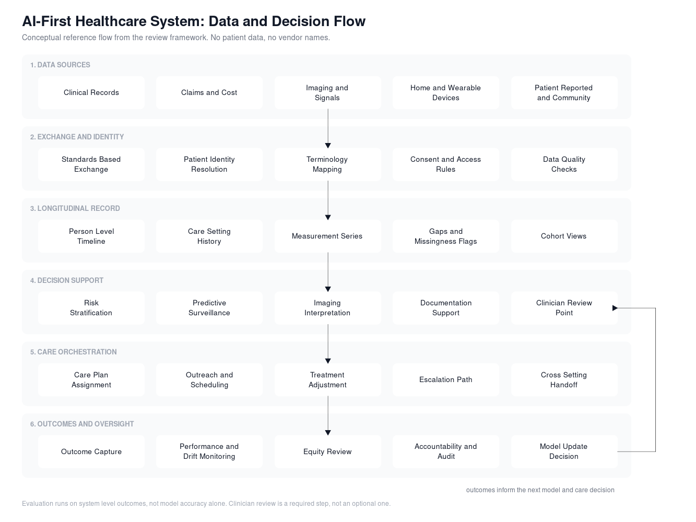

# AI-First Healthcare: System Framework

Published research on what a health system looks like when AI is treated as core infrastructure rather than a set of separate tools bolted onto existing workflows.

**Exploring an AI-First Healthcare System.** Gates A, Ali A, Conard S, Dunn P. *Bioengineering* (Basel), 2026 Jan 17;13(1):112. [DOI](https://doi.org/10.3390/bioengineering13010112) | [PubMed](https://pubmed.ncbi.nlm.nih.gov/41596043/) | [Full text](https://pmc.ncbi.nlm.nih.gov/articles/PMC12837376/)

I am the first author. This repository holds the system framing, the reference data flow, and a diagram source you can open and edit. It contains no patient data, no institutional data, and no vendor detail beyond what the published paper already states.

## Problem statement

AI is already in use across most parts of care delivery, but the deployments are fragmented. Each one solves a single task, sits on top of a legacy workflow, and reports its own accuracy number. That produces a familiar pattern: strong results on narrow tasks, weak evidence that any of it changed how a patient actually moves through the system.

The gap is not model quality. It is these five things:

1. **Data fragmentation.** A patient record is split across settings and systems, so nothing follows the person over time.
2. **Workflow misalignment.** Tools get added next to the work instead of inside it, which pushes the integration cost onto clinicians.
3. **Bias in the models.** Performance varies by population, and most deployments do not check for that after go-live.
4. **Thin governance.** Ownership, review cadence, and shutdown criteria are frequently undefined before deployment.
5. **Missing evaluation.** Very little prospective, multi-site evidence on outcomes, cost, and equity.

The question this work asks is not whether a given model performs well. It is what has to be true structurally for care to be coordinated across settings, and what is still missing before that is possible.

## What the paper concludes

- Task level capability is mature in imaging interpretation, documentation support, predictive surveillance, and remote monitoring.
- Capability for coordination across time and across settings is not mature. That is the bottleneck.
- Evaluation has to move from accuracy on a held out set to outcomes at the system level: what happened to patients, cost, and equity.
- Human judgment stays in the loop by design. The framework treats clinician review as a required step, not an optional one.
- Hypertension management and full patient journey are used as worked examples of proactive risk stratification, coordinated intervention, and continuous follow up.

## Reference data flow



Six layers, each with its own owner and its own failure mode.

| Layer | What it does | What breaks without it |
| --- | --- | --- |
| Data sources | Clinical records, claims, imaging and signals, home devices, patient reported and community data | Blind spots between visits |
| Exchange and identity | Standards based exchange, identity resolution, terminology mapping, consent rules, quality checks | The same person looks like several people |
| Longitudinal record | Person level timeline, setting history, measurement series, gap flags, cohort views | No basis for trend or risk over time |
| Decision support | Risk stratification, surveillance, imaging interpretation, documentation support, clinician review | Predictions with no route into care |
| Care orchestration | Care plan assignment, outreach, treatment adjustment, escalation, handoffs across settings | Insight that never reaches the patient |
| Outcomes and oversight | Outcome capture, drift monitoring, equity review, audit, model update decisions | Silent decay, no accountability |

The loop from oversight back into decision support is the part most deployments skip. It is what separates a system that learns from a system that just runs.

## Diagram sources

- `docs/data-flow.svg` and `docs/data-flow.png`, the rendered reference flow.
- `docs/data-flow.mmd`, Mermaid source. Lucidchart imports this directly through Import Data, and it also renders inside GitHub.
- `docs/lucidchart-flow.csv`, node and connector list for Lucidchart CSV import if you prefer to lay it out by hand.

Both source files describe the same flow. Edit either one, then re-export.

## Where the field stands

Reference points from the literature the paper builds on. These describe what has been established and what has not, rather than a single leaderboard number, because comparable prospective multi-site results do not yet exist.

| Reference | What it establishes | What it leaves open |
| --- | --- | --- |
| [Liu et al., Lancet Digital Health 2019](https://doi.org/10.1016/S2589-7500(19)30123-2) | Deep learning matches clinician performance on diagnostic imaging tasks across a large body of studies | Nearly all evidence is retrospective and single task, with few head to head prospective trials |
| [Topol, Nature Medicine 2019](https://doi.org/10.1038/s41591-018-0300-7) | Sets out the case for pairing machine capability with clinician judgment rather than replacing it | Does not specify the operating model that makes the pairing work day to day |
| [Rajpurkar et al., Nature Medicine 2022](https://doi.org/10.1038/s41591-021-01614-0) | Maps where clinical AI has real traction and where translation stalls | Deployment, monitoring, and maintenance remain largely unsolved |
| [Ngiam and Khor, Lancet Oncology 2019](https://doi.org/10.1016/S1470-2045(19)30149-4) | Shows the delivery side value of large scale data and learning methods | Assumes data access and integration that most systems do not have |
| [Davenport and Kalakota, Future Healthcare Journal 2019](https://doi.org/10.7861/futurehosp.6-2-94) | Frames the operational and adoption barriers directly | Predates most current governance and equity requirements |

The pattern across all five: task performance is settled, system performance is not. That is the gap this framework targets.

## What I brought to this work

- Framed the problem at the system level instead of the model level, which is the framing that decides what actually gets built.
- Designed the reference architecture and the data flow, including the exchange and identity layer that most roadmaps underestimate.
- Set the evaluation position: system outcomes over accuracy metrics, with monitoring and equity review as standing requirements rather than a post launch add on.
- Ran the work to publication with co-authors across a national nonprofit, a research institute, and a clinical practice.

## Citation

```
Gates A, Ali A, Conard S, Dunn P. Exploring an AI-First Healthcare System.
Bioengineering (Basel). 2026 Jan 17;13(1):112. doi:10.3390/bioengineering13010112
```

## Contact

GitHub: [ali8gates](https://github.com/ali8gates)
